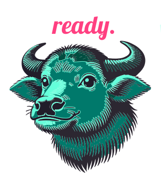

#  Ready - AI-Powered Moving Assistant

[](https://opensource.org/licenses/MIT)
[](https://github.com/Ready-PoC)

<p align="center">
  <strong>Founded by:</strong> Yinuo Geng, Kevin Logan, and Joshua Lee
</p>

## 🚀 Overview

**Ready** is an AI-powered moving assistant designed to transform the relocation experience by reducing complexity and streamlining logistics in one centralized platform. By leveraging advanced AI recommendations, automation, and personalized support, Ready simplifies the moving process for young professionals and families.

This proof of concept (PoC) demonstrates the core functionalities and potential of Ready, showcasing key aspects of our innovative approach to solving common moving challenges.

## ✨ Key Features

- **AI-Driven Recommendations** - Personalized neighborhood matching and service provider suggestions
- **Automated Task Management** - Smart checklists and timelines customized to your move
- **Real-Time Coordination** - Integrated scheduling and communication with service providers
- **Post-Move Support** - Seamless transition assistance after relocation

## 📊 Business Model (Lean Canvas)

### 1️⃣ Problem
Moving is inherently stressful, requiring coordination of multiple services, complex scheduling, and critical decision-making under time pressure. Existing solutions are fragmented, forcing users to navigate numerous tools without a unified system. Ready addresses this by centralizing and automating essential moving tasks, providing personalization and comprehensive coordination.

### 2️⃣ Existing Alternatives
Traditional methods like checklists, task management apps, and assistant services address only parts of the moving journey. Ready differentiates by offering an end-to-end, AI-driven solution that adapts to individual needs, providing automation, real-time tracking, and seamless integration through a unified platform.

### 3️⃣ Customer Segments
Ready targets individuals and families relocating due to job transitions, corporate assignments, or lifestyle changes. These users prioritize convenience, efficiency, and structured processes that minimize disruption to their personal and professional lives.

### 4️⃣ Unique Value Proposition
Ready transforms moving into a seamless journey through:
- Personalized guidance and recommendations
- Automated task management
- Real-time service coordination
- Reduced decision fatigue
- Optimized time management

### 5️⃣ Solution Components
- **AI-Powered Neighborhood Matching** - Find your ideal location based on preferences
- **Smart Checklists** - Automatically generated and prioritized moving tasks
- **Real-Time Tracking** - Monitor all aspects of your move from one dashboard
- **Post-Move Guidance** - Seamless integration into your new community

### 6️⃣ Channels
Ready reaches users through:
- Organic content marketing (SEO, blogs, social media)
- Strategic partnerships with HR relocation teams
- Realtor and moving company affiliations
- Targeted digital advertising

### 7️⃣ Revenue Streams
- Freemium model with basic services offered at no cost
- Premium AI-driven planning features
- Assistant service fees
- Commission-based partnerships with moving-related businesses

### 8️⃣ Cost Structure
- AI and software development
- Cloud infrastructure
- Customer acquisition
- Strategic partnerships
- Lean operations with emphasis on automation

### 9️⃣ Key Metrics
- Customer acquisition rates
- User engagement levels
- Customer retention
- Revenue growth
- User satisfaction and NPS

### 🔟 Unfair Advantage
Ready's competitive edge comes from:
- Proprietary AI-driven relocation matching algorithms
- Adaptive user profiles and personalization
- Automated workflows for service coordination
- Scalable nationwide platform
- Potential for expansion into adjacent markets

## 💻 Technical Implementation

### Prerequisites

* Node.js 20+ (LTS version recommended)
* npm or yarn

### Installation

1. Clone the repository:
   ```bash
   git clone https://github.com/readyMoveAI/readyapp.git
   cd readyapp
   ```

2. Install dependencies:

   **Client**:
   ```bash
   npm install
   # or
   yarn install
   ```

   **Server**:
   ```bash
   python3 -m vevn ready_venv
   source ready_venv/bin/activate
   pip install -r app/backend/requirements.txt
   ```

3. Configure environment variables (if needed):
   ```bash
   cp .env.example .env.local
   # Edit .env.local file with your configuration
   ```

### Running the Application

1. Start the development server:

   **Client:**
   ```bash
   npm run dev
   # or
   yarn dev
   ```

   **Server:**
   ```bash
   python3 app/backend/app.py
   ```

2. Access the application at http://localhost:3000

### Building for Production

1. Build the application:
   ```bash
   npm run build
   # or
   yarn build
   ```

2. Start the production server:
   ```bash
   npm run start
   # or
   yarn start
   ```

## 📞 Contact

For questions or feedback, please reach out to the Ready team at [contact@readymove.ai](mailto:contact@readymove.ai).

---

<p align="center">© 2025 Ready. All rights reserved.</p>
